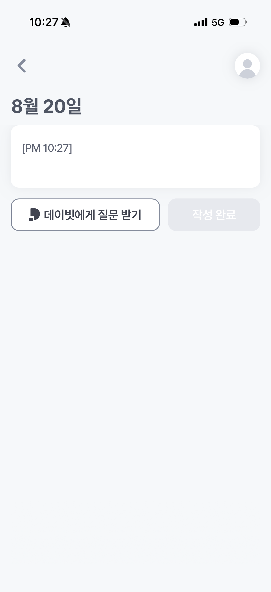
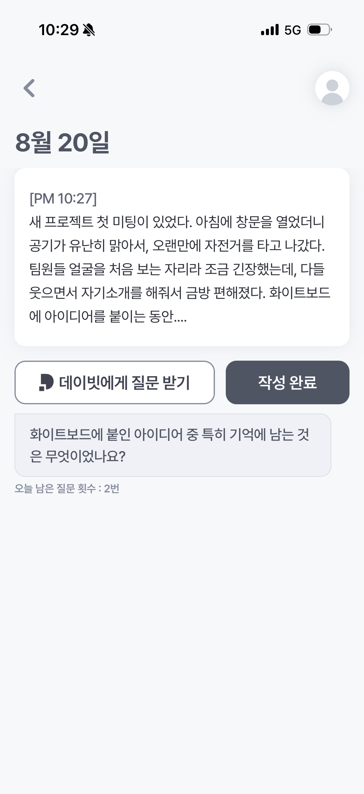
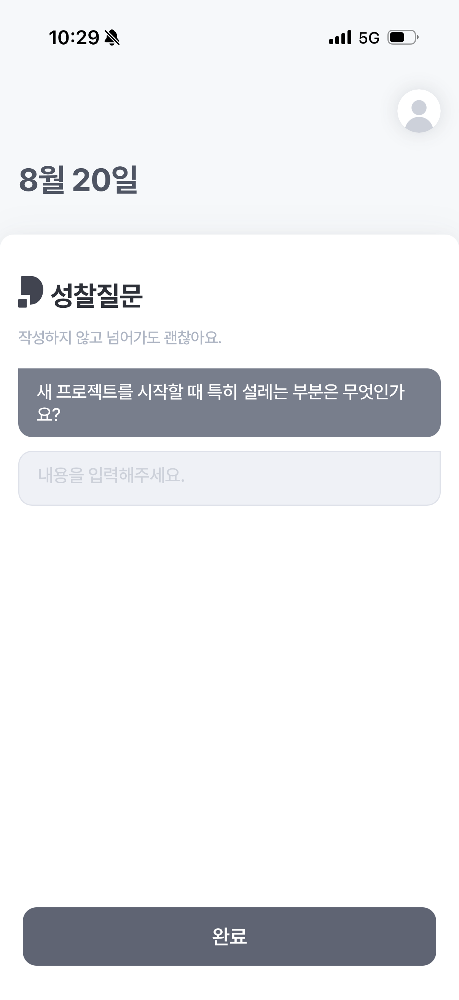
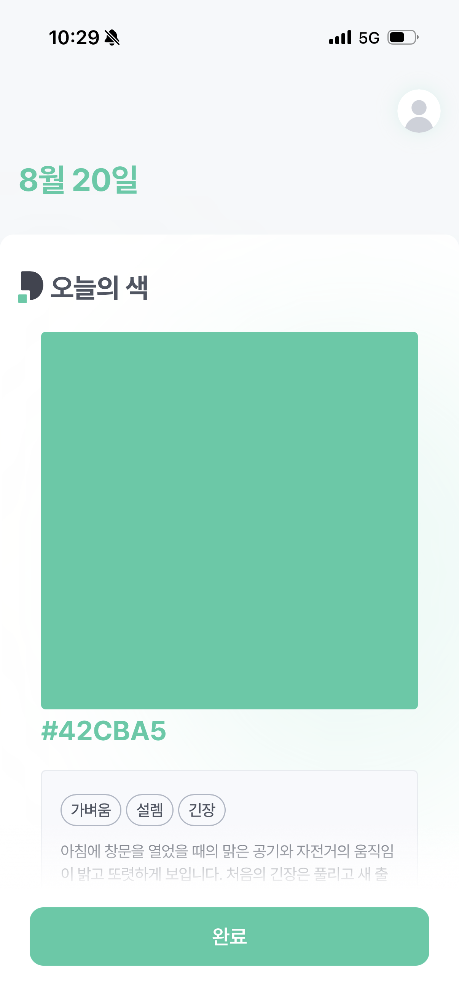
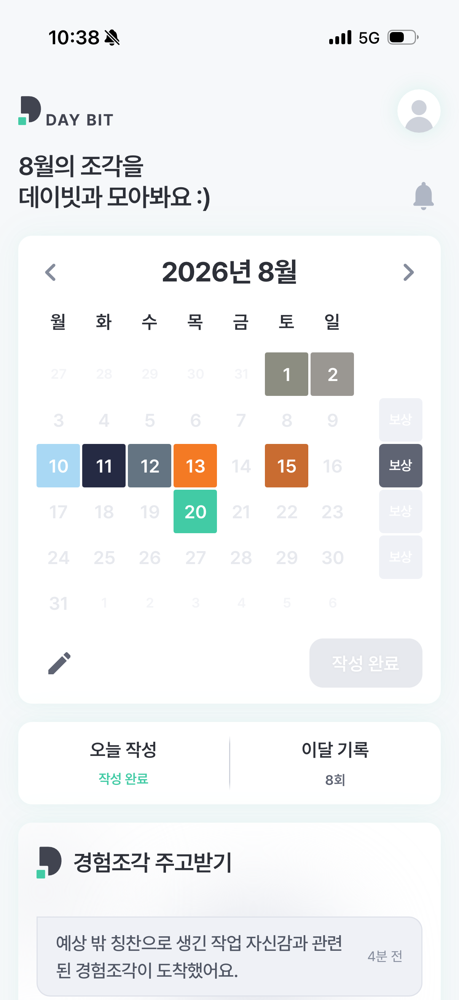
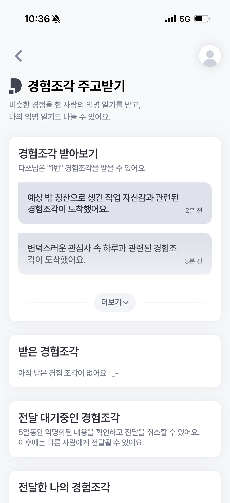

# DAYBIT

## 1. 프로젝트 개요

**하루를 기록하면 오늘의 색이 남는 일기 앱.**

일기를 쓰면 AI가 그날의 감정을 분석해 **오늘의 색**을 만들어 주고, 한 주가 모이면 그 색들로 **주간 이미지**를 생성한다.
익명화된 일기 조각을 서로 주고받는 **경험조각** 기능으로 비슷한 하루를 보낸 사람과 연결된다.

기록은 대체로 세 지점에서 멈춘다. 무엇을 써야 할지 막막해 기록이 성찰로 이어지지 않고, 써도 돌아오는 것이 없어 지속할 동기가 떨어지고, 혼자 쓰다 보면 자기 관점에 머물지만 공개적인 공유나 조언은 부담스럽다.

DAYBIT은 이 셋을 각각 **작성 도움 질문과 성찰 질문**, **쌓일수록 커지는 색과 주간 이미지**, **자신을 드러내지 않는 익명 경험 공유**로 해결하려 했다.

모바일 웹 기반 PWA로, 홈 화면에 설치하면 네이티브 앱처럼 동작한다.

---

## 2. 기술 스택

### 코어

| 분류   | 기술                      | 버전 | 선택 이유                                                                 |
| ------ | ------------------------- | ---- | ------------------------------------------------------------------------- |
| UI     | React                     | 19.2 | 함수형 컴포넌트 + 훅 기반. 별도 상태관리 라이브러리 없이 내장 훅으로 구성 |
| 라우팅 | React Router              | 7.18 | `BrowserRouter` SPA 라우팅, 페이지 간 `state` 전달로 불필요한 재조회 방지 |
| 빌드   | Vite (Rolldown)           | 8.2  | 빠른 HMR, Rolldown 번들러로 프로덕션 빌드 1초 내외                        |
| 스타일 | Tailwind CSS              | 4.3  | `@tailwindcss/vite` 플러그인. 디자인 토큰은 `@theme`으로 정의             |
| HTTP   | Axios                     | 1.19 | 인터셉터로 CSRF 주입 · 토큰 재발급을 한곳에서 처리                        |
| 폰트   | Pretendard                | 1.3  | npm 패키지로 셀프 호스팅해 외부 CDN 의존 제거                             |
| PWA    | vite-plugin-pwa (Workbox) | 1.3  | 오프라인 캐싱, 홈 화면 설치, 자동 업데이트                                |

### 개발 환경

| 분류   | 기술                                                                   |
| ------ | ---------------------------------------------------------------------- |
| 린트   | ESLint 10 + `eslint-plugin-react-hooks`, `eslint-plugin-react-refresh` |
| 이미지 | sharp (PWA 아이콘 생성)                                                |
| 배포   | Vercel                                                                 |

---

## 3. 설치 및 실행 방법

### 요구 사항

- Node.js 20 이상
- 실행 중인 DAYBIT 백엔드 서버

### 1) 저장소 클론 및 의존성 설치

```bash
git clone https://github.com/mrainbeat/likelion14th_Hackathon.git
```

```bash
cd likelion14th_Hackathon && npm install
```

### 2) 환경 변수 설정

프로젝트 루트에 `.env` 파일을 만들고 백엔드 주소를 넣는다.

```bash
VITE_API_BASE_URL=https://api.daybit.cloud
```

### 3) 개발 서버 실행

```bash
npm run dev
```

`http://localhost:3000`이 자동으로 열린다. (포트는 `vite.config.js`에 고정)

> 백엔드가 JWT를 HttpOnly 쿠키로 내려주므로 모든 요청에 `withCredentials`가 켜져 있다. 로컬 개발 시 백엔드 CORS 허용 목록에 `http://localhost:3000`이 있어야 로그인이 된다.

### 스크립트

| 명령              | 설명                    |
| ----------------- | ----------------------- |
| `npm run dev`     | 개발 서버 (HMR)         |
| `npm run build`   | 프로덕션 빌드 → `dist/` |
| `npm run preview` | 빌드 결과 로컬 확인     |
| `npm run lint`    | ESLint 검사             |

---

## 4. 폴더 구조

```
.
├── docs/                         README용 스크린샷
├── public/                       PWA 아이콘 · 파비콘
├── index.html                    SPA 진입점
├── vite.config.js                Vite · Tailwind · PWA(Workbox) 설정
├── vercel.json                   SPA rewrite 규칙
└── src/
    ├── api/
    │   └── apiClient.js          axios 인스턴스 · CSRF · 토큰 재발급 인터셉터
    ├── assets/                   아이콘 · 로고 · 이미지 (SVG 중심)
    ├── components/
    │   ├── Layout.jsx            390×796 모바일 프레임 (데스크톱에서도 앱 비율 유지)
    │   ├── AnimatedBlobs.jsx     배경 블러 그라데이션 애니메이션
    │   └── SpeechBubble.jsx      말풍선 컴포넌트
    ├── contexts/
    │   └── DevAccessProvider.jsx 개발자 도구 접근 제어
    ├── hooks/
    │   ├── useCurrentTime.js     서비스 기준 현재 시각
    │   └── useSlideUp.js         바텀시트 슬라이드업 모션
    ├── pages/
    │   ├── Auth/                 로그인 · 회원가입 · 카카오 콜백
    │   ├── Onboarding/           닉네임 → 하루 전환 시간 → 알림 → 동의
    │   ├── Home/                 캘린더 홈 · 일기 목록/상세 · 주간 이미지
    │   ├── Diary/                작성 · 성찰 질문 · 오늘의 색
    │   ├── Experience/           경험조각 목록 · 상세 · 검토
    │   ├── MyPage/               설정 · 휴지통 · 숨김 · 약관
    │   └── Notification/         알림함
    └── utils/
        ├── serviceDate.js        하루 전환 시간 기준 날짜 계산
        ├── rewardColor.js        OKLCH 색 보정 + 팔레트 캐시
        ├── diaryDraft.js         로컬 임시저장
        ├── diaryDraftApi.js      서버 임시저장 · heartbeat · 자동완료 안내
        ├── todayDiary.js         오늘 작성 여부 판정 (휴지통 · 숨김 포함)
        ├── experienceFragments.js 경험조각 API + 목록 가공
        ├── weeklyRewards.js      주간 보상 API + 상세 캐시
        ├── notifications.js      알림 API + 타입별 제목 · 이동 경로
        ├── me.js                 /api/me 단일 비행(single-flight) 요청
        ├── nickname.js           닉네임 캐시
        └── *Cache.js             월별 일기 · 주간 보상 · 알림 캐시
```

---

## 5. 주요 기능

|                          일기 작성                           |                           작성 도움 질문                           |                         성찰 질문                          |
| :----------------------------------------------------------: | :----------------------------------------------------------------: | :--------------------------------------------------------: |
|  |  |  |
|            진입 시 타임스탬프가 자동으로 들어간다            |              쓴 내용을 바탕으로 이어 쓸 질문을 받는다              |       오늘 쓴 일기를 바탕으로 데이빗이 질문하나를 던진다         |

|                          오늘의 색                           |                          캘린더 홈                           |                          경험조각                          |
| :----------------------------------------------------------: | :----------------------------------------------------------: | :--------------------------------------------------------: |
|  |         |  |
|         일기를 분석해 색 · 키워드 · 코멘트를 만든다          |        오늘 하루의 색이 포인트에 반영, 캘린더에 기록된다.          |          익명화 된 일기를 주고받고 짧은 반응을 남긴다           |


> 한 주의 일기가 모여 만들어진 주간 이미지. 아래 색들이 그 주 하루하루의 색이다.

### 일기 작성

- 진입 시 `[PM 10:27]` 형식의 타임스탬프가 자동 삽입되고, 10분 내 재진입 시에는 중복 삽입하지 않는다.
- **이중 임시저장** — 로컬(500ms 디바운스)과 서버(1s 디바운스)에 함께 저장한다.
- **작성 중 heartbeat** — 화면이 열려 있고 `visibilityState === "visible"`인 동안 30초마다 신호를 보낸다. 서버 lease가 약 90초이므로 3분의 1 주기로 잡았다. 하루 경계를 넘겨도 작성 중이면 자동완료되지 않는다.
- 완료 시 `draftId`를 함께 보내, 저장 날짜가 **draft가 처음 만들어진 날짜**로 고정된다. (자정 넘겨 쓴 일기가 다음 날로 넘어가지 않음)
- **작성 도움 질문** — 지금까지 쓴 내용을 바탕으로 AI가 이어 쓸 질문을 제안한다. (하루 한도 3번)
- 이미 오늘 일기를 썼다면 홈 버튼 비활성 · 알림 탭 이동 차단 · `/diary` 직접 접근 시 홈으로 되돌리기까지 3중으로 막는다.

### 오늘의 색

- 저장 직후 AI가 색 · 키워드 · 코멘트를 생성한다. `PENDING`이면 보상 전용 엔드포인트를 800ms 간격으로 폴링해, 폴링 트래픽에 본문 · 성찰 질문이 실려 오지 않는다.
- 받은 색이 너무 밝으면 텍스트 대비가 무너지므로 **OKLCH 색공간에서 명도를 눌러 별도의 UI 강조색**을 계산한다. 위 스크린샷에서 날짜 · 로고 · 완료 버튼이 그날의 색을 따라가는 것이 이 값이다.

### 주간 이미지

- **생성은 전적으로 서버가 한다.** 사용자의 하루 전환 시간을 기준으로 한 주가 끝나면 서버가 그 주의 색과 키워드를 모아 이미지를 만든다. 사용자는 생성을 요청하지 않고 결과만 조회한다.
- 생성이 완료되면 사용자가 접속했을 때 모달을 띄워 결과를 확인할 수 있도록 해준다.
- 생성 시점은 확정적이지 않다. 전주 일기를 아직 쓰고 있으면 생성이 보류됐다가 완료 후 재시도 되므로, "하루 전환 + N분이면 반드시 있다"고 가정하지 않고 비동기 결과로 다룬다.
- 확인 여부(`viewed`)는 서버에 저장되므로 새로고침하거나 기기를 바꿔도 모달이 다시 뜨지 않는다.

### 경험조각 주고받기

- 일기를 익명화해 공유하면 비슷한 주제를 가진 다른 사용자에게 전달된다.
- 전달 전 **5일간 검토 기간**이 있어 익명화 결과를 확인하고 취소할 수 있다. 원문과 익명화본을 토글로 비교한다.
- 도착함에는 주제 · 키워드만 오고 본문은 열람해야 볼 수 있다.
- 받은 조각에는 짧은 반응을 남길 수 있고, 원작성자는 자기 조각에 달린 반응을 확인한다. 서로의 정보는 끝까지 공개되지 않는다.

### 자동 작성완료 안내

하루 경계를 넘겨 서버가 일기를 자동 완료하면, 홈에서 진입 즉시 + 60초 주기로 확인해 안내 모달을 띄우고 확인 시 서버에 기록한다. 판정이 서버 필드라 로컬 저장소를 지우거나 기기를 바꿔도 다시 뜨지 않는다.

### 그 외

- 일기 목록 / 상세 / 추가 기록, 숨김 처리, 휴지통(복구 · 영구삭제)
- 알림함(안 읽음 배지, 60초 폴링), 알림 시간 설정, 하루 전환 시간 설정
- 최초 진입 튜토리얼 — 완료 여부를 서버로 관리해 기기가 바뀌어도 한 번만 노출된다.

### 구현 하이라이트

**인증 · 네트워크** — JWT가 HttpOnly 쿠키라 프론트는 토큰을 저장하지 않는다. 상태를 바꾸는 요청에만 CSRF 토큰을 붙이고, 동시에 여러 요청이 나가도 발급 Promise를 공유해 한 번만 받는다.

**캐시 우선 렌더링** — 조회성 데이터는 로컬 캐시로 즉시 그린 뒤 서버 값으로 갱신해 진입 시 깜빡임이 없다. 다만 **판단은 항상 서버 값으로 한다.** "주간 이미지를 봤는지", "튜토리얼을 끝냈는지" 같은 상태는 서버 필드로만 결정하므로 로컬 저장소를 지워도 본 모달이 다시 뜨지 않는다. 로그인 · 로그아웃 시 모든 캐시를 초기화해 계정을 바꿔도 이전 사용자 데이터가 남지 않는다.

**하루 경계 처리** — DAYBIT의 하루는 자정이 아니라 사용자가 정한 전환 시간에 시작한다. `Intl.DateTimeFormat`으로 기기 타임존과 무관하게 Asia/Seoul 기준 시각을 구한 뒤 전환 시간 이전이면 하루를 빼서 서비스 날짜를 계산한다.

**렌더링 성능** — 목록 가공은 원본 배열이 바뀔 때만 수행하도록 메모이제이션했고, 캘린더 셀과 보상 배지는 `memo`로 감싸 월 전환 애니메이션 중 셀 단위 재렌더가 없다.

---

## 6. 배포 정보

**Vercel**에 배포한다. `vercel.json`의 rewrite 규칙으로 모든 경로를 `index.html`로 보내 SPA 새로고침 시 404가 나지 않게 한다.

```json
{ "rewrites": [{ "source": "/(.*)", "destination": "/" }] }
```

| 항목             | 값                         |
| ---------------- | -------------------------- |
| 배포 플랫폼      | Vercel                     |
| Root Directory   | `./` (저장소 루트)         |
| Build Command    | `npm run build`            |
| Output Directory | `dist`                     |
| 환경 변수        | `VITE_API_BASE_URL`        |
| 백엔드 주소      | `https://api.daybit.cloud` |
| 서비스 주소      | `https://www.daybit.cloud` |

**PWA** — 빌드 시 Workbox가 서비스워커를 생성한다. `registerType: "autoUpdate"` + `skipWaiting` + `clientsClaim` 조합으로 새 버전 배포 시 사용자가 옛 캐시를 붙들지 않고 즉시 갱신된다. `navigateFallbackDenylist`로 `/api` 요청은 서비스워커를 우회하고, 폰트는 `CacheFirst`로 1년간 캐싱한다.

---

## 7. 기타

### 기여 방법

1. `dev` 브랜치에서 기능 브랜치를 딴다. (`feat/…`, `fix/…`)
2. 작업 후 `npm run lint`와 `npm run build`가 통과하는지 확인한다.
3. `dev`로 PR을 올린다. 배포용 브랜치는 `main`이다.
4. 'main' 브랜치는 직접 푸쉬하지 말 것.

**커밋 메시지** — `[Feat]` / `[Fix]` / `[Chore]` 접두사와 한국어 요약을 쓴다.

```
[Feat] 휴지통 복구 확인 모달 추가
[Fix] 주간 이미지 키워드가 중복 노출되는 문제 수정
```

### 코드 컨벤션

- 그레이 스케일은 `grey-0`(#FFFFFF)부터 `grey-95`(#414450)까지 11단계, 배경은 `#F6F8FA` 고정.
- 아직 제공하지 않는 메뉴는 글자를 `grey-40`으로 낮추고 아이콘 · 화살표까지 흐리게 처리해 활성 항목과 구분한다.
- 사용자에게 보이는 에러 문구는 서버 응답 메시지를 그대로 노출하지 않고 화면에서 직접 정의한다.

### 도메인 규칙

| 규칙           | 내용                                                                                                |
| -------------- | --------------------------------------------------------------------------------------------------- |
| 하루 1개       | 일기는 DAYBIT 날짜 기준 하루에 하나. 자정이 아니라 사용자가 정한 `dayStartTime`이 하루의 시작       |
| 수정 불가      | 일기 수정 API가 없다(그 당시의 느낌으로만 적을 수 있도록). 덧붙일 내용은 추가 기록으로 여러 개 작성 |
| 삭제           | 즉시 영구삭제가 아닌 Soft Delete → 휴지통에서 복원 또는 영구삭제                                    |
| 색 보상        | 비동기 생성. 작성 직후 `PENDING`으로 내려올 수 있어 재조회 필요                                     |
| 주간 보상      | 월~일 기준, 직전 주 일기 3개 이상일 때 생성                                                         |
| 작성 도움 질문 | DAYBIT 하루 기준 최대 3회                                                                           |
| 자동 완료      | 하루 경계를 넘겼는데 draft가 남아 있으면 서버가 일기를 자동 완료                                    |

**날짜는 항상 서버의 `recordedDate`를 신뢰한다.** 프론트에서 자정 기준으로 단정하면 `dayStartTime`을 쓰는 사용자에게 하루가 어긋난다.

### 개발용 API

날짜 지정 일기 작성과 주간 이미지 수동 생성은 개발용 API를 쓴다. `X-Daybit-Dev-Password` 헤더가 필요하고, 비밀번호는 소스에 두지 않고 `DevAccessProvider`의 메모리 상태로만 보관한다. 새로고침하면 다시 입력해야 한다.

### 참고 자료

- API 응답은 `{ isSuccess, code, message, result }` 봉투로 통일돼 있다. **`result`가 비면 `null`이 아니라 필드 자체가 사라지므로** 값이 없을 수 있는 응답은 옵셔널 체이닝으로 받는다.
- 에러는 HTTP 상태가 아니라 `DIARY409_1`(오늘 일기 이미 작성), `QUESTION429`(질문 3회 초과), `WEEKLY_REWARD409`(미생성 주간 보상) 같은 도메인 코드로 분기한다.
- 알림 타입은 `DIARY_REMINDER` / `EXPERIENCE_FRAGMENT_ARRIVED` / `EXPERIENCE_FRAGMENT_FEEDBACK` / `WEEKLY_REWARD_COMPLETED` 4종이다. 자동완료용 타입이 없어 자동 작성완료는 알림함이 아니라 전용 안내 모달로 전달된다.

### 라이선스

멋쟁이사자처럼 14기 해커톤 출품작.
